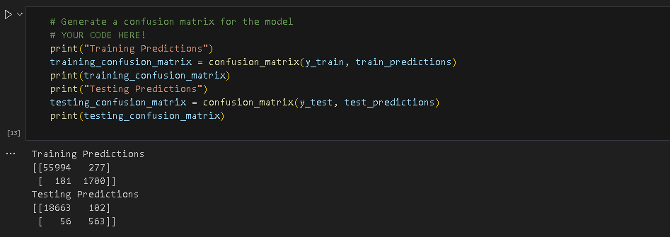
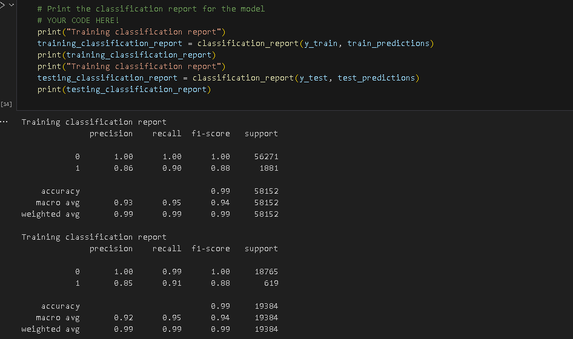

# Module 12 Report Template

## Overview of the Analysis

The purpose of this analysis was to create a machine learning model capable of classifying loan applicants as either "healthy loans" or "high-risk loans" based on their financial data. The dataset contained information on factors such as loan size, interest rates, borrower income, debt-to-income ratio, and the total number of accounts.

The primary variable to predict was binary: 0 for "healthy loans" and 1 for "high-risk loans." The dataset was imbalanced, with "healthy loans" dominating. To address this challenge, a Logistic Regression model was used.

The process included:
Splitting the dataset into training and testing subsets.
Training the model on the  dataset.
Evaluating the model's performance using key metrics: accuracy, F1 score, precision, and recall.

Target variable loan_status value counts:
0 for "healthy loans" has 75036 counts
1 for "high-risk loans has  2500 counts

## Results

Machine Learning Model :git status

* Accuracy Score: 99.18%
* F1 Score: 0.88
* Precision Score: 0.85
* Recall: 0.91 (specific to identifying high-risk loans)

Here is the confusion matrix of the model:

## Summary

The Logistic Regression model performed well overall, achieving high accuracy and balanced performance across precision and recall. It was slightly better at predicting "healthy loans" than "high-risk loans," but it still showed a strong ability to detect high-risk applicants, with a recall of 91%.

## Recommendation:

The current model is suitable for deployment, as its high recall ensures that most high-risk loans are correctly identified. If further optimization is needed, resampling techniques or alternative models (e.g., Random Forests) could be explored to enhance performance on high-risk loan prediction.

